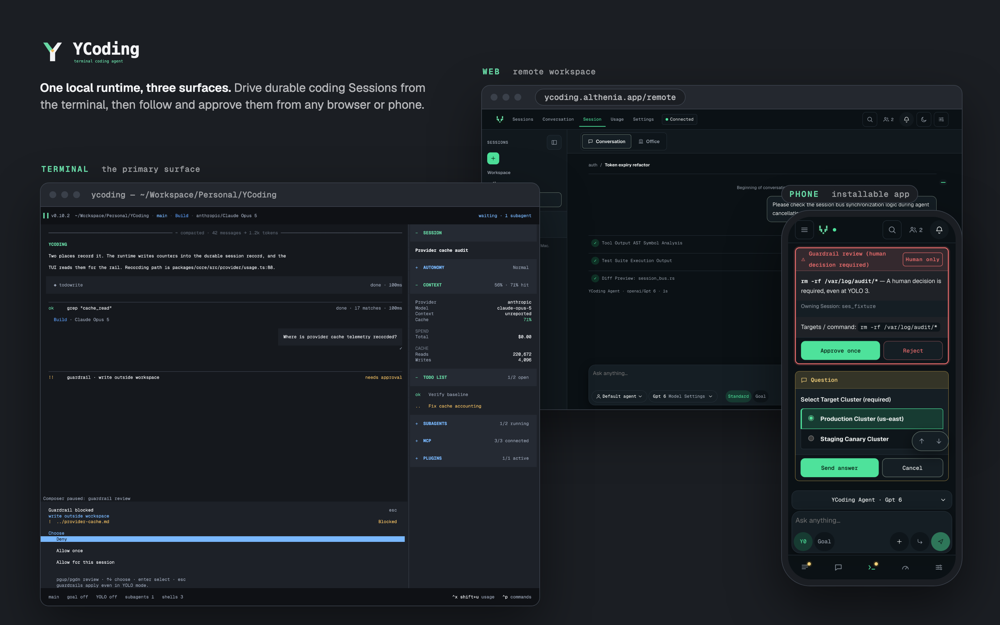
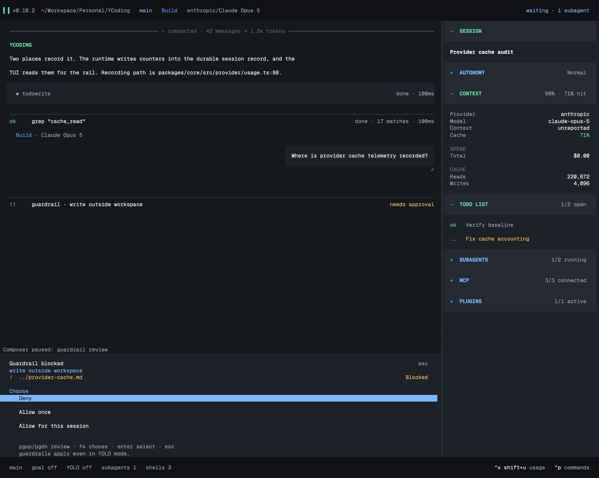
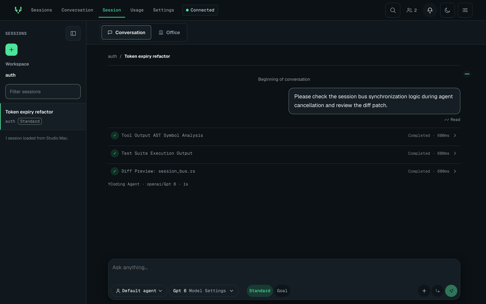
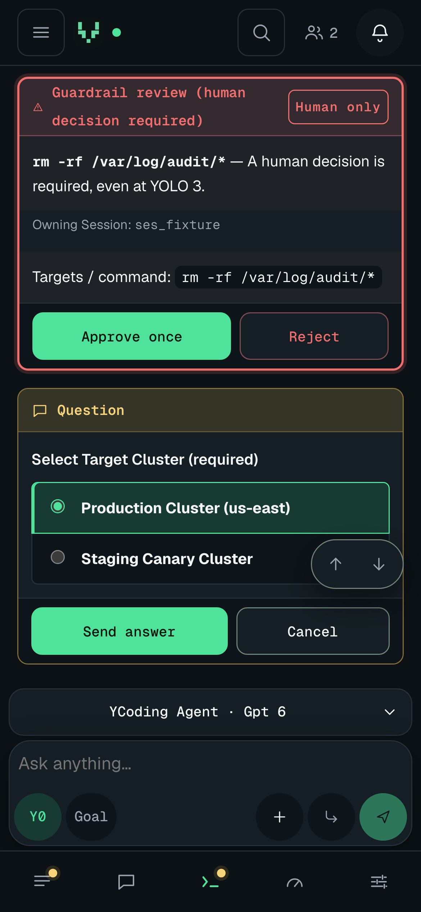

# YCoding

[](https://github.com/Althenia/ycoding/releases/latest)
[](./LICENSE)
[](https://github.com/Althenia/ycoding/releases/latest)
[](https://ycoding.althenia.app/docs)

**A terminal-first coding agent that runs on your own machine.** YCoding keeps every Session durable, lets you decide how much it may do on its own, and puts the same local runtime in your browser and on your phone when you step away from the terminal.

Your repository, shell, tools, and model calls stay in the local `ycoding` process. The web app is a remote control for that process, not a hosted agent.

Latency and client-timing telemetry stays in local SQLite and is disabled until you enable the machine-wide consent choice; token and cost usage remain available independently.

<p align="center">
  
</p>

## Why YCoding

- **Durable Sessions.** History, pending prompts, todos, and subagents survive restarts and reconnects. Steer a running Session or queue work for when it goes idle.
- **Autonomy you choose.** YOLO 0 is manual; 1 auto-approves ask permissions and ordinary guardrail reviews; 2 also answers questions/forms; 3 also permits opt-in scope dispatch. Set a `/goal` to continue until completion, stop, or exhausted attempts, with automatic answers, ask permissions and opt-in scope dispatch even at YOLO 0.
- **Guardrails across the whole Session family.** High-impact actions such as writes outside the workspace, force pushes, or destructive commands require review in the main Session and every subagent. Ordinary reviews auto-approve at YOLO 1-3; hard reviews always need a human, even at YOLO 3.
- **Background subagents.** Delegate work to durable child Sessions that inherit your permission limits, and watch their progress in the Session rail.
- **Use your accounts side by side.** Keep several named profiles per provider — API keys or subscription sign-ins such as Claude Code, ChatGPT, or GitHub Copilot — and pick one per Session or subagent with `profile#provider/model#variant`. See [provider profiles](./docs/configuration.md#provider-profiles).
- **Many providers.** OpenAI, Anthropic, Google, GitHub Copilot, OpenRouter, xAI, Amazon Bedrock, Azure, Mistral, Groq, and more, plus any OpenAI-compatible endpoint.
- **Your phone as a remote.** The Focus workspace puts Sessions, Usage, and Settings in a collapsible desktop rail or a three-item phone bar, with explicit New session and Back actions. Enroll your machine once, then read transcripts, send prompts, and answer permissions, guardrail reviews, and questions from any browser or the installable phone app, with opt-in push alerts when a Session needs you.
- **Repository-native customization.** Agents, commands, skills, hooks, plugins, and MCP servers live next to your code.
- **Browser and computer control.** Work in [paired Chrome tabs or agent-owned tabs](./docs/browser-extension.md) and in [scoped macOS windows](./docs/computer-use.md), with per-site and per-tool permissions.
- **Workspace memory.** Save and search [linked Markdown knowledge](./docs/memory.md) with an offline graph, kept separate from transcripts and prompts.
- **Opt-in next-message prediction.** Fill, never send, a suggested next message in the TUI or web composer; optionally inform its background helper with permission-checked workspace-memory snippets.
- **Opt-in meeting intelligence.** Use the [local meeting extension](./docs/meeting-intelligence.md) for consented Google Meet capture, configurable Thai Whisper transcription, evidence-backed plans and reviewed MCP proposals.

## Quick start

**macOS (Apple Silicon or Intel) and Linux (x64)** — requires `curl`, `tar`, and `shasum` or `sha256sum`:

```sh
curl -fsSL https://ycoding.althenia.app/install.sh | sh
```

The installer downloads the latest release, verifies its SHA-256 checksum, and installs `ycoding` in `~/.local/bin`. Follow the PATH instructions it prints, then open a new terminal in your project:

```sh
ycoding
```

Type `/connect` in the composer to add a provider profile, then describe your task.

**Windows (x64):** download the ZIP from [GitHub Releases](https://github.com/Althenia/ycoding/releases/latest), extract `ycoding.exe`, and run it in your terminal.

Run a single prompt without opening the interface:

```sh
ycoding --model <[profile#]provider/model[#variant]> "Explain this repository"
```

Keep up to date with `ycoding update`. See [installation](https://ycoding.althenia.app/docs/installation) for macOS permissions, quarantine, and upgrade notes.

## Three surfaces, one runtime

| Terminal | Web | Phone |
| --- | --- | --- |
|  |  |  |
| The primary surface: transcript, Session rail, reviews, shells, and subagents in your terminal. | Sessions, conversations, usage, and settings for every Session on your enrolled machine. | The same workspace on a phone, with opt-in push alerts for reviews, finished work, and offline machines. |

To use the [remote workspace](https://ycoding.althenia.app/remote/), sign in, open **Settings → Devices → Create enrollment code**, and run the displayed command on your machine. It prompts for the one-use code, so the code never lands in shell history. Then turn on the connection:

```sh
ycoding remote enroll <enrollmentID>
ycoding remote connect
```

> [!WARNING]
> While the machine is connected, the signed-in account can reach every existing and future Session on that machine. Connect only machines and accounts you trust.

See [remote workspace](https://ycoding.althenia.app/docs/usage/remote) for sign-in options, recovery, and connection states.

## Guardrails

Permissions decide what an agent may attempt; guardrails review or deny high-impact operations across the main Session and its subagents. An approval never overrides an explicit permission denial or a built-in catastrophic denial.

Add your own rules as one Markdown file per rule:

- **Workspace:** `.ycoding/guardrails/*.md` in the project.
- **User:** `~/.config/ycoding/guardrails/*.md`.

See the [guardrail guide](./docs/guardrails-and-provider-usage.md#session-guardrails) and the tested [AWS resource protection example](./docs/guardrails-and-provider-usage.md#aws-example-deny-destructive-resource-operations). Guardrails inspect supported tool actions and resource strings; they do not replace filesystem isolation or cloud IAM policies.

## Documentation

- [Getting started](https://ycoding.althenia.app/docs/getting-started) and [quickstart](https://ycoding.althenia.app/docs/quickstart)
- [Working in the terminal](https://ycoding.althenia.app/docs/usage/tui) and [command line](https://ycoding.althenia.app/docs/usage/cli)
- [Providers and profiles](https://ycoding.althenia.app/docs/configuration/providers), [agents](https://ycoding.althenia.app/docs/configuration/agents), [MCP](https://ycoding.althenia.app/docs/configuration/mcp), [goal](https://ycoding.althenia.app/docs/configuration/goal), and [YOLO mode](https://ycoding.althenia.app/docs/configuration/yolo)
- [Troubleshooting](https://ycoding.althenia.app/docs/troubleshooting) and the [changelog](https://ycoding.althenia.app/changelog)
- Engineering references: [runtime](./docs/runtime.md), [configuration](./docs/configuration.md), [architecture](./docs/architecture.md), and the [documentation index](./docs/README.md)

<details>
<summary>Build from source</summary>

With **Bun 1.4.2** installed:

```sh
bun install --frozen-lockfile
bun run dev
```

Build and smoke-test the terminal application, then install it locally on macOS or Linux:

```sh
bun run build:tui
bun run smoke:tui
bun run smoke:runtime
bun run install:local
```

Build and test the web app:

```sh
bun run build:web
bun run test:web
bun run test:remote
```

See [contributing guidance](./AGENTS.md) for targeted tests, repository checks, and the release process.

</details>

## License

YCoding is licensed under the GNU Affero General Public License, version 3 only (AGPL-3.0-only). See [LICENSE](./LICENSE) for the full text and [NOTICE](./NOTICE) for the upstream MIT notice it retains.
